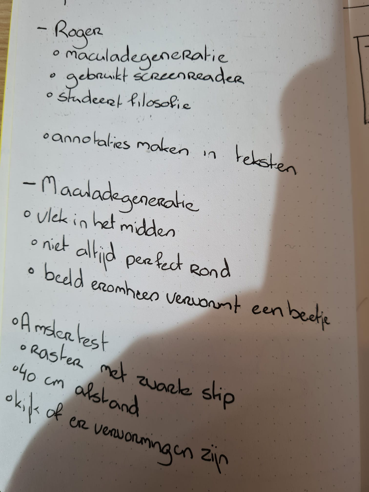
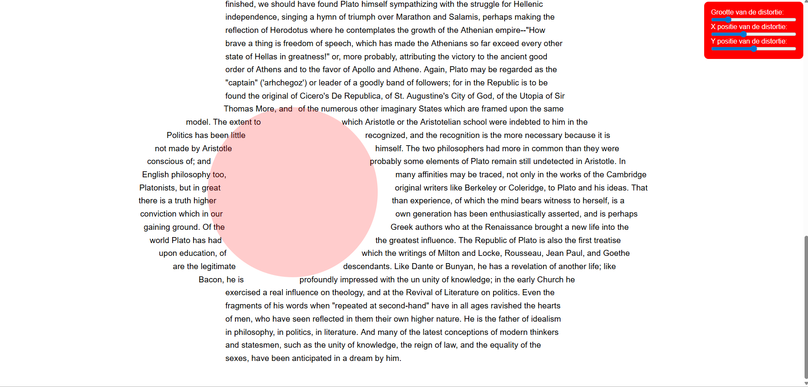
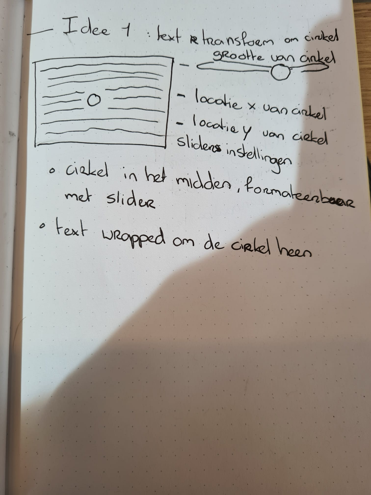
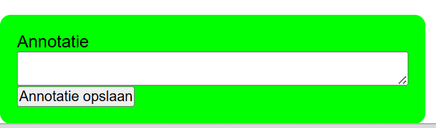

# Melvin-Web_HCD

Doelgroep: Roger

## Week 1

### Dag 1: Maandag 30 - 3 - 2026
Vandaag was de eerste dag dat we aan deze opdracht gingen beginnen. Ik heb roger aangewezen gekregen. Een man die masculadegeneratie heeft. Dit is een aandoening waarbij zijn zicht steeds minder goed wordt omdat er een zwarte vlek bevindt die bij hem steeds groter wordt waardoor hij steeds minder ziet. Om deze opdracht te beginnen heb ik eerst wat aantekeningen gemaakt. De foto daarvan staat hieronder, maar heb ze ook even netjes hier uitgewerkt in de readme.   
Roger
* Maculadegeneratie
* Gebruikt screenreader
* Studeert filosofie
* Wil graag annotaties maken in teksten

Maculadegeneratie
* Vlek in het beeld, niet altijd perfect in midden
* Niet altijd perfect rond
* Beeld eromheen vervormt een beetje

Aslertest
* Raster met een zwarte stip
* Moet je op 40cm afstand houden en met 1 oog naar kijken
* Kijk of er vervormingen zijn en of er een zwarte vlek ontstaat



Ik had 2 verschillende ideeën voor deze opdracht. Verder in de readme staan mijn eerste ideeën kort uitgewerkt in mijn notitieboekje. Vandaag ben ik bezig geweest met het uitwerken van het eerste idee. Deze had ik namelijk ook aan Vasilis voorgesteld en die vond hem mooi absurd om te testen. Het idee was om een object te hebben die fixed op de webpagina staat die je kan verplaatsen en vergroten. Maar die div zelf moet niet gelezen of gezien worden door een screenreader. Ik probeer het eerst met door de div een float te geven zodat de tekst eromheen vormt. Dit lukte helaas niet, want float kon alleen aan het begin of aan het eind, niet in het midden. Na wat moeite had ik het aan AI gevraagd. Die wilde het eerst ook alleen met float proberen, later had ik aangemoedigd om het met JavaScript op te lossen, na nog wat gedoe lukte het eindelijk om de tekst eromheen te laten formateren. Daarna was het alleen nog een beetje spelen zodat het er goed uitzag en dat de slider er invloed op hadden. Ook moest ik nog even kijken naar hoe het beter zou maken voor een screenreader. Want nu werd van elk woord een span gemaakt, maar ik wil niet dat ze los worden voorgelezen. Ik sla dus eerst de originele tekst op gebruik die voor een aria-label op de p, en doe aria-hidden op alle span elementen. Als laatste vandaag heb ik nog toegevoegd dat de localhost de waardes van de sliders opslaat zodat die daarna weer gebruikt kunnen worden als standaard, dan hoef je hem niet opnieuw in te stellen. Dit gaat handig zijn tijdens de test van morgen want kan ik ook goed zien welke delen van het scherm Roger wel nog redelijk kan zien en welke niet. Daar kan ik dan meer focus op leggen. Voor de rest heb ik nog mijn Lorem Ipsum vervanging door een tekstje over Plato, die link staat hieronder.



#### Hulp van AI
Prompts: 
* Write me a a script that makes each word in the p a span and wrap those around the sticky distorter element
* Almost worked. I can see that words are moving according to that circle, but the different spans are moving into each other and the actual width of the circle isnt properly calculated I think
```
const p = document.getElementById("text");
const words = p.textContent.split(/\s+/);
p.textContent = "";

words.forEach(word => {
  const span = document.createElement("span");
  span.textContent = word + " ";
  p.appendChild(span);
});

const distorter = document.getElementById("distorter");

function wrapWords() {
  const rect = distorter.getBoundingClientRect();
  const radius = rect.width / 2;
  const centerX = rect.left + radius;
  const centerY = rect.top + radius;
  const padding = 4; // spacing between circle and text

  document.querySelectorAll("#text span").forEach(span => {
    const spanRect = span.getBoundingClientRect();
    const spanX = spanRect.left + spanRect.width / 2;
    const spanY = spanRect.top + spanRect.height / 2;

    const dy = spanY - centerY;

    // Only move words if they are within the vertical bounds of the circle
    if (Math.abs(dy) < radius) {
      // horizontal offset using circle equation
      const offsetX = Math.sqrt(radius * radius - dy * dy) + padding;
      // move left or right depending on which side the span is
      const dx = spanX < centerX ? -offsetX : offsetX;
      span.style.transform = `translateX(${dx}px)`;
    } else {
      span.style.transform = "translateX(0px)";
    }
  });
}

window.addEventListener("scroll", wrapWords);
window.addEventListener("resize", wrapWords);
wrapWords();
```

#### Idee 1: Text laten transformeren om een cirkel heen
Het idee is om de filosofische tekst te laten vervormen om een cirkel heen. De gebruiker kan dan zelf de dirkel positioneren en groter en kleiner maken aan de hand van sliders zodat de tekst altijd leesbaar is om de vlek heen. Dit moet uiteraard goed getest worden, maar Vasilis vondt hem wel goed absurd. Hiervoor is waarschijnlijk javascript nodig omdat een float niet in het midden gezet kan worden.



#### Idee 2: De teksten laten annoteren
Op het scherm is een standaard knop die je kan leiden naar je annotaties. Hier moet een sneltoets voor gemaakt worden zodat je er altijd makkelijk naartoe kan. Als je op die knop druk krijg je een overzicht met per annotatie: in welke sectie van de tekst de annotatie staat, over welke tekst het gaat, de annotatie zelf, en een knop om naar die annotatie te springen in de tekst. Om dit te laten werken moet je makkelijk de tekst kunnen selecteren. Het makkelijk zo zijn om sneltoetsen te maken om woorden te selecteren en dan spans van de maken in de code.


#### Weekly Geek
Exclusive Design
Bron: https://exclusive-design.vasilis.nl/

Designing websites for people that design websites.
Tailor made websites for people with dissabilities

Different Exclusive design principles
* Study Situation
Studying the different contexts of people with dissabilities well enough.
* Ignore conventions
Do the current web conventions work for people with dissabilities? Because most of them are created by designers, for designers.
* Prioritise identity
Design things especially for people with dissabilities play an active role in the design process. Designing with those people.
* Add nonsense
Adding nonsense will life the website beyond the functional. Creates interesting and fun new ideas and projects

It is important design for people with dissabilities, because we can. So that they can live more independent lives. inclusive websites are good business model because more people are able to use your website properly , so there are financial reasons to design inclusively.   

Flipping Things
https://exclusive-design.vasilis.nl/flipping-things/

An interface is a pleasure to use, if Léonie is able to fulfil her task without needing extra help. Even then she can still use developer tools to change the technical workings of the websites. So her standards are pretty low. There is a big gap between designing websites for ourselves and websites for people with special needs.

Inclusive Design Principles
The idea is that when you use these, your website will be more accessible. A good set of principles should be able to be flipped, but also have between 3 and 5 items. This makes it easier to remember. Originally there were 7, Vasilis combined a few to make 4 in total.

* Consider all contexts -> Study Situation
When making an inclusive website it is important to know all the different contexts in which people will use it. Consider peoples abilities (motor control, poor eye sight). Consider the hardware they preferably use. Consider the software they use, like screenreaders.
It is important to consider all contexts, but only if the design team understands them. It is better to focus on one piece of context.

* Be consistent -> Ignore conventions
Inconsistency can confuse people. For some users there is no things as familiar conventions. Some patterns like navigation on top we take for granted, but dont work well for screenreader users. So you might want to ignore the basic conventions.

* Prioritise content -> Prioritse identity
There are certainly websites that could use more attentions when it comes to their content, but it is hard to imagine that negelect content as a design principle.
Identity plays a big factor when it comes to good content. There are different types of identity. Identies are everywhere and are used all the time. But some identities are excluded when designing websites. What if we use those?

* Add value -> Add nonsense
Doesnt make any sense to not add extra features to improve experience. Before we can add value for different users, we have to research different ways of adding value. A good way is to just use nonsensical ideas. They might sound ridiculous to some, but very usefull to someone else context. Ideas that make people laugh, and then make them think.

In summary the inclusive design principles assume we have expert knowledge of designing for excluded people. They also assume the patterns we nowadays use are well tested and good to use. Adding nonsense to a website could include something that could actually work. You cant focus fully on the content. But it could bring insights in the people that you make it for.

#### Checkout met Jeppe
Jeppe had al meer gedaan met annotaties. Hij had een systeem waarbij je per woord een annotatie kan toevoegen en een tag kan meegeven. Dit was een handig systeem om later ze terug te kunnen vinden. Maar zelf leek het me een beetje onhandig omdat je al die tags moet onthouden. Zelf had ik een ander idee, een knop waarbij je bij al je annotaties komt en ze vandaar kan bekijken. Maar het is niet een slecht idee om een manier te hebben om je annotaties te sorteren.

#### Bronnen
https://classics.mit.edu/Plato/republic.1.introduction.html

### Dag 2: Dinsdag 31 - 3 - 2026
Vandaag was ik begonnen met het maken van het annotatie menu. Dit probeerde ik eerst met AI te doen, maar merkte al snel dat het niet de juiste kant op ging en ik tegen veel dingen aanliep. Ik ga het dus een andere keer proberen zelf te maken. Ik had namelijk veel moeite met het echt opslaan van de annotaties in de localhost en ze dan weer laten zien in een annotatie menu. Het leek me een stuk handiger om dit een andere keer stap voor stap te gaan doen. Voor nu leek het me beter als ik me meer zou focussen op de test van vanmiddag. Dus ben ik verder gegaan met het bedenken van vragen die ik wil stellen tijdens de test zodat ik daarna een beter beeld heb van Roger en dat ik beter weet waar ik focus op moet leggen. Met mijn huidige design met de distortion is het ook lastig om delen specieke delen te selecteren. Want voor dat effect van waar de vlek zit, wordt elk woord een eigen span. Voor de accessibility moest ik de originele tekst pakken en die in een aria-label zetten en dat elke span aria hidden is. Maar dat maakt het voor een screen reader wel lastig om dan specifieke delen te selecteren om daar uiteindelijk annotaties van te maken. Het leek me wel handig om veel te doen met felle kleuren, want uit aannames en onderzoek online stond er dat je vooral dingen wazig zien en dat je geen focus punt echt hebt als je maculadegeneratie hebt. Dus met felle kleuren is het dan makkelijker om iets aan te geven dan met een kadertje. 



#### Vragen voor eerste test Roger
- Wat is je ervaring met screenreaders?
- Welke screenreader gebruik je?
- Heb je specifiek dingen waar je altijd tegenaan loopt met screenreaders?
- Hoe ervaar jij maculadegeneratie?
- Kan je uitleggen wat je precies wel en niet ziet?
- Zou je het fijner vinden werken met kaders voor container of juiste hele felle kleuren?
- Wat voor interesses heb je?
- Tegen wat voor dingen loop je tegenaan op die websites?
- Bezoek je websites vaker op je telefoon of op een desktop?

#### Aantekningen Test met Roger Rafelli
59 jaar oud, 43 toen eerste symptomen kreeg
Werktuigbouwkunde achtergrond
erfelike versie van macula degeneratie, niet geneesbaar
andere vorm van leven gekregen, kan niet meer werken of auto rijden
sommige dingen zijn nog niet beschikbaar voor slechtziende
"Kerk silhouette zie je, maar de klok kan je niet zien"
Ziet wel nog steeds gewoon goed alle kleuren, vroeg of laat worden ze wel aangetast. Contrast is heel belangrijk, maar ook lichtgevoeligheid
Continu aan het aanpassen, altijd aan het leren
Blinde geleide hond, gaat ook met pensioen na zoveel tijd (5 jaar)
Er zijn wel hulpmiddelen, en de meeste helpen ook wel veel. Maar niet alles is er nog. Wordt wel elk jaar beter.
Stichting Fidelio in Eindhoven

Gestopt als werktuigbouwkundige, is toch boeken gaan "lezen". Maar viel vaak in slaap. Luisterboeken hielp ook niet. Dus ging hij filosofie studeren zodat hij boeken ging lezen en annotaties kon maken om actief te gaan lezen.
Wilt aantekeningen kunnen maken van waar het staat. Wilt een makkelijke manier om notities terug te vinden. 
Hij heeft wel een notitieboekje, maar kan niet meer zijn eigen handschrift lezen
Tooltje waar hij een tekst in kan vullen zodat hij makkelijk aantekeningen kan maken
Kan geen volledige zinnen meer lezen, je moet het voorstellen alsof je altijd een vuist voor je gezicht heeft.
Heeft wel skills geleerd om het nog een beetje te kunnen, maar is nog steeds lastig.
Dingen met kleur signaleren is mogelijk.
Fan van dark mode, dus we willen niet een volledig witte website hebben
Kan dus niet echt meer zijn eigen handschrift, maar door het op te schrijven helpt het wel met onthouden.
Met Word heb je ook wel bepaalde knopjes om aantekeningen te maken, maar het is vooral altijd lastig om ze dan terug te vinden
Auditief heeft wel voorkeur, dat het wordt voorgelezen. 
Voorkeur voor typen
Wat heel irritant is als mensen zeggen dat het toegankelijk is, maar het niet helemaal niet is. Dat soms het wel aan de WCAG voldoet, maar nog steeds niet goed werkt voor een slechtziende
Met 1 oplossing kan je niet de hele doelgroep bereiken, wordt soms een beetje misbruikt. (Bijvoorbeeld Braille)
Lieveer een soort Word bestand waar hij aantekeningen in kan maken, ipv een website waar hij aantekeningen kan maken
Lastig om sommige boeken te kunnen lezen, want niet alles heeft een braille of digitale versie.
Leest boeken op desktop en mobiel, maar maakt de aantekeningen altijd vanaf desktop. Want daar gaat het iets makkelijker.
Er is wel behoefte om het op mobiel te kunnen, maar er is nog geen makkelijke tool voor. Lastig om notities terug te vinden
NVDA en Supernova als screenreader gebruikt hij
Aantekeningen koppelen aan een specifiek soort boek. (Dus het is wel handig als de aantekeningen gesorteerd zijn)
Zit een beetje in een tussengebied, hij kan nog wel dingen zien, maar heeft wel een screenreader nodig omdat het ook snel vermoeid.
Sorteert atm notities per bladzijdes, maar is wel handig om een sub categorie te hebben daarvoor ipv alleen per boek.

Proof of concepts 
Niet duidelijk waar je bent, wat actief is
Moeten kunnen navigeren binnen een tekst. 
Handig dat teksten soort van gemarkeerd worden van waar je bent in de tekst
Wilt wel nog steeds een beetje mee kunnen lezen, zonder dat het vermoeiend wordt
Handig dat het per zin gaat.
Annotaties met meestal meer dan 1 regel
Verschillende programma's hebben verschillende sneltoetsen
Je weet misschien wel dat het de tweede opmerking is, maar het is slecht soms terug te vinden
Verschillende instellingen voor bijvoorbeeld lettergroottes kan handig zijn
zwart geel is een fijn kleur contrast

MIJN OPDRACHT
Lastig om nog steeds zinnen te lezen
Wordt snel vermoeiend
Wel een echt leuk idee omdat wel echt goed het probleem weer geeft
Markeren met achtergrond in verschillende kleuren zou waarschijnlijk niet verbeteren