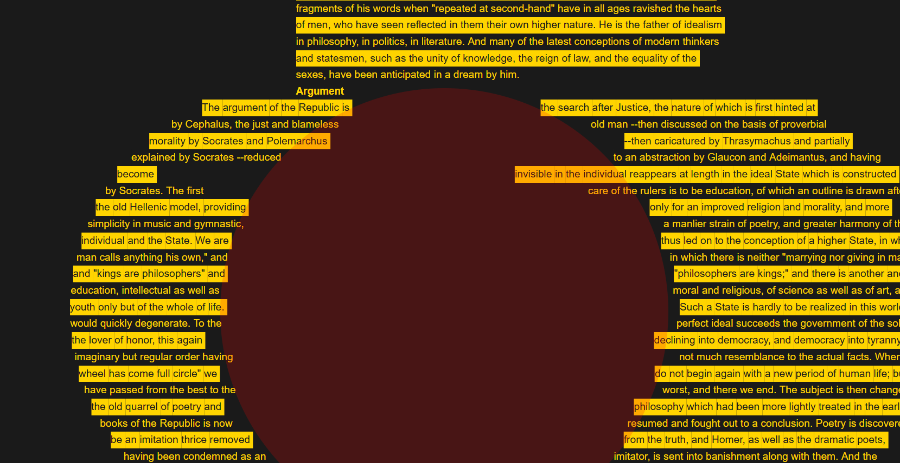
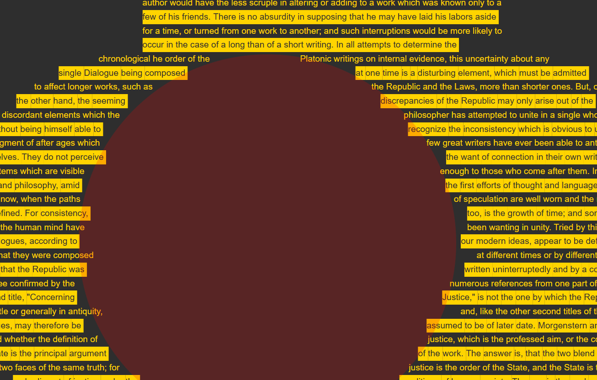
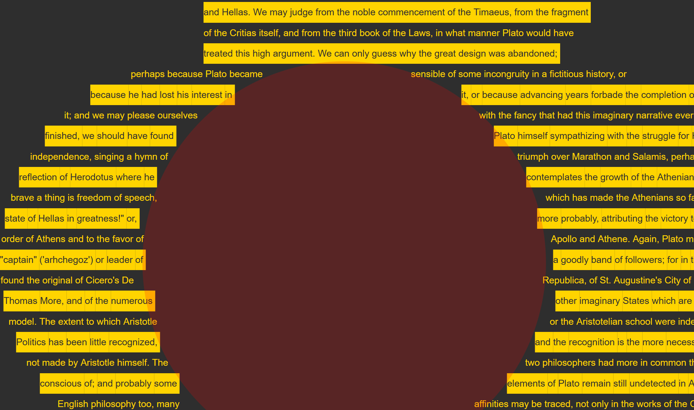
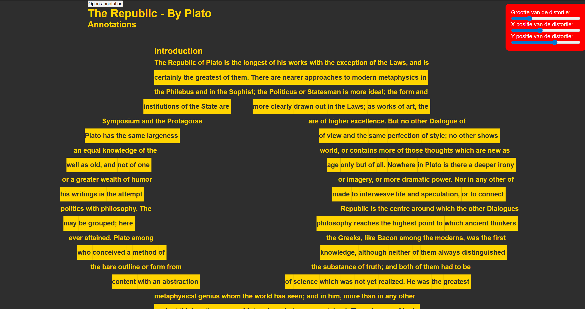
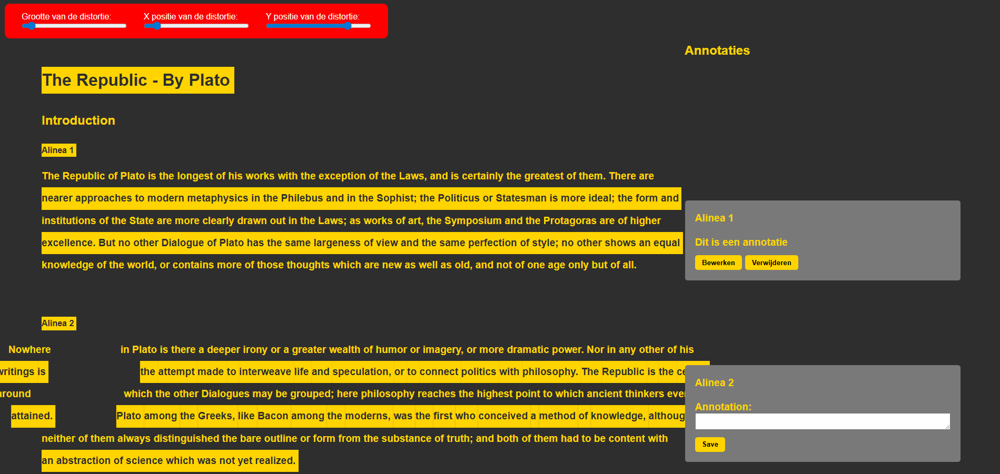
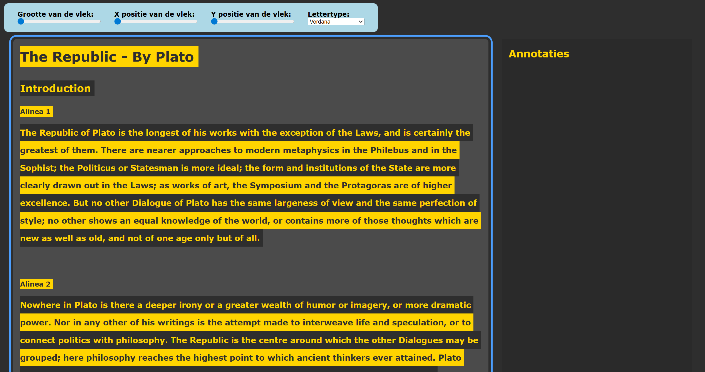

# Melvin-Web_HCD

Doelgroep: Roger

## Week 1

### Dag 1: Maandag 30 - 3 - 2026
Vandaag was de eerste dag dat we aan deze opdracht gingen beginnen. Ik heb roger aangewezen gekregen. Een man die masculadegeneratie heeft. Dit is een aandoening waarbij zijn zicht steeds minder goed wordt omdat er een zwarte vlek bevindt die bij hem steeds groter wordt waardoor hij steeds minder ziet. Om deze opdracht te beginnen heb ik eerst wat aantekeningen gemaakt. De foto daarvan staat hieronder, maar heb ze ook even netjes hier uitgewerkt in de readme.   
Roger
* Maculadegeneratie
* Gebruikt screenreader
* Studeert filosofie
* Wil graag annotaties maken in teksten

Maculadegeneratie
* Vlek in het beeld, niet altijd perfect in midden
* Niet altijd perfect rond
* Beeld eromheen vervormt een beetje

Aslertest
* Raster met een zwarte stip
* Moet je op 40cm afstand houden en met 1 oog naar kijken
* Kijk of er vervormingen zijn en of er een zwarte vlek ontstaat


Ik had 2 verschillende ideeën voor deze opdracht. Verder in de readme staan mijn eerste ideeën kort uitgewerkt in mijn notitieboekje. Vandaag ben ik bezig geweest met het uitwerken van het eerste idee. Deze had ik namelijk ook aan Vasilis voorgesteld en die vond hem mooi absurd om te testen. Het idee was om een object te hebben die fixed op de webpagina staat die je kan verplaatsen en vergroten. Maar die div zelf moet niet gelezen of gezien worden door een screenreader. Ik probeer het eerst met door de div een float te geven zodat de tekst eromheen vormt. Dit lukte helaas niet, want float kon alleen aan het begin of aan het eind, niet in het midden. Na wat moeite had ik het aan AI gevraagd. Die wilde het eerst ook alleen met float proberen, later had ik aangemoedigd om het met JavaScript op te lossen, na nog wat gedoe lukte het eindelijk om de tekst eromheen te laten formateren. Daarna was het alleen nog een beetje spelen zodat het er goed uitzag en dat de slider er invloed op hadden. Ook moest ik nog even kijken naar hoe het beter zou maken voor een screenreader. Want nu werd van elk woord een span gemaakt, maar ik wil niet dat ze los worden voorgelezen. Ik sla dus eerst de originele tekst op gebruik die voor een aria-label op de p, en doe aria-hidden op alle span elementen. Als laatste vandaag heb ik nog toegevoegd dat de localhost de waardes van de sliders opslaat zodat die daarna weer gebruikt kunnen worden als standaard, dan hoef je hem niet opnieuw in te stellen. Dit gaat handig zijn tijdens de test van morgen want kan ik ook goed zien welke delen van het scherm Roger wel nog redelijk kan zien en welke niet. Daar kan ik dan meer focus op leggen. Voor de rest heb ik nog mijn Lorem Ipsum vervanging door een tekstje over Plato, die link staat hieronder.


#### Hulp van AI
Prompts: 
* Write me a a script that makes each word in the p a span and wrap those around the sticky distorter element
* Almost worked. I can see that words are moving according to that circle, but the different spans are moving into each other and the actual width of the circle isnt properly calculated I think
```
const p = document.getElementById("text");
const words = p.textContent.split(/\s+/);
p.textContent = "";

words.forEach(word => {
  const span = document.createElement("span");
  span.textContent = word + " ";
  p.appendChild(span);
});

const distorter = document.getElementById("distorter");

function wrapWords() {
  const rect = distorter.getBoundingClientRect();
  const radius = rect.width / 2;
  const centerX = rect.left + radius;
  const centerY = rect.top + radius;
  const padding = 4; // spacing between circle and text

  document.querySelectorAll("#text span").forEach(span => {
    const spanRect = span.getBoundingClientRect();
    const spanX = spanRect.left + spanRect.width / 2;
    const spanY = spanRect.top + spanRect.height / 2;

    const dy = spanY - centerY;

    // Only move words if they are within the vertical bounds of the circle
    if (Math.abs(dy) < radius) {
      // horizontal offset using circle equation
      const offsetX = Math.sqrt(radius * radius - dy * dy) + padding;
      // move left or right depending on which side the span is
      const dx = spanX < centerX ? -offsetX : offsetX;
      span.style.transform = `translateX(${dx}px)`;
    } else {
      span.style.transform = "translateX(0px)";
    }
  });
}

window.addEventListener("scroll", wrapWords);
window.addEventListener("resize", wrapWords);
wrapWords();
```

#### Idee 1: Text laten transformeren om een cirkel heen
Het idee is om de filosofische tekst te laten vervormen om een cirkel heen. De gebruiker kan dan zelf de dirkel positioneren en groter en kleiner maken aan de hand van sliders zodat de tekst altijd leesbaar is om de vlek heen. Dit moet uiteraard goed getest worden, maar Vasilis vondt hem wel goed absurd. Hiervoor is waarschijnlijk javascript nodig omdat een float niet in het midden gezet kan worden.


#### Idee 2: De teksten laten annoteren
Op het scherm is een standaard knop die je kan leiden naar je annotaties. Hier moet een sneltoets voor gemaakt worden zodat je er altijd makkelijk naartoe kan. Als je op die knop druk krijg je een overzicht met per annotatie: in welke sectie van de tekst de annotatie staat, over welke tekst het gaat, de annotatie zelf, en een knop om naar die annotatie te springen in de tekst. Om dit te laten werken moet je makkelijk de tekst kunnen selecteren. Het makkelijk zo zijn om sneltoetsen te maken om woorden te selecteren en dan spans van de maken in de code.


#### Weekly Geek
Exclusive Design
Bron: https://exclusive-design.vasilis.nl/

Designing websites for people that design websites.
Tailor made websites for people with dissabilities

Different Exclusive design principles
* Study Situation
Studying the different contexts of people with dissabilities well enough.
* Ignore conventions
Do the current web conventions work for people with dissabilities? Because most of them are created by designers, for designers.
* Prioritise identity
Design things especially for people with dissabilities play an active role in the design process. Designing with those people.
* Add nonsense
Adding nonsense will life the website beyond the functional. Creates interesting and fun new ideas and projects

It is important design for people with dissabilities, because we can. So that they can live more independent lives. inclusive websites are good business model because more people are able to use your website properly , so there are financial reasons to design inclusively.   

Flipping Things
https://exclusive-design.vasilis.nl/flipping-things/

An interface is a pleasure to use, if Léonie is able to fulfil her task without needing extra help. Even then she can still use developer tools to change the technical workings of the websites. So her standards are pretty low. There is a big gap between designing websites for ourselves and websites for people with special needs.

Inclusive Design Principles
The idea is that when you use these, your website will be more accessible. A good set of principles should be able to be flipped, but also have between 3 and 5 items. This makes it easier to remember. Originally there were 7, Vasilis combined a few to make 4 in total.

* Consider all contexts -> Study Situation
When making an inclusive website it is important to know all the different contexts in which people will use it. Consider peoples abilities (motor control, poor eye sight). Consider the hardware they preferably use. Consider the software they use, like screenreaders.
It is important to consider all contexts, but only if the design team understands them. It is better to focus on one piece of context.

* Be consistent -> Ignore conventions
Inconsistency can confuse people. For some users there is no things as familiar conventions. Some patterns like navigation on top we take for granted, but dont work well for screenreader users. So you might want to ignore the basic conventions.

* Prioritise content -> Prioritse identity
There are certainly websites that could use more attentions when it comes to their content, but it is hard to imagine that negelect content as a design principle.
Identity plays a big factor when it comes to good content. There are different types of identity. Identies are everywhere and are used all the time. But some identities are excluded when designing websites. What if we use those?

* Add value -> Add nonsense
Doesnt make any sense to not add extra features to improve experience. Before we can add value for different users, we have to research different ways of adding value. A good way is to just use nonsensical ideas. They might sound ridiculous to some, but very usefull to someone else context. Ideas that make people laugh, and then make them think.

In summary the inclusive design principles assume we have expert knowledge of designing for excluded people. They also assume the patterns we nowadays use are well tested and good to use. Adding nonsense to a website could include something that could actually work. You cant focus fully on the content. But it could bring insights in the people that you make it for.

#### Checkout met Jeppe
Jeppe had al meer gedaan met annotaties. Hij had een systeem waarbij je per woord een annotatie kan toevoegen en een tag kan meegeven. Dit was een handig systeem om later ze terug te kunnen vinden. Maar zelf leek het me een beetje onhandig omdat je al die tags moet onthouden. Zelf had ik een ander idee, een knop waarbij je bij al je annotaties komt en ze vandaar kan bekijken. Maar het is niet een slecht idee om een manier te hebben om je annotaties te sorteren.

#### Bronnen
https://classics.mit.edu/Plato/republic.1.introduction.html

### Dag 2: Dinsdag 31 - 3 - 2026
Vandaag was ik begonnen met het maken van het annotatie menu. Dit probeerde ik eerst met AI te doen, maar merkte al snel dat het niet de juiste kant op ging en ik tegen veel dingen aanliep. Ik ga het dus een andere keer proberen zelf te maken. Ik had namelijk veel moeite met het echt opslaan van de annotaties in de localhost en ze dan weer laten zien in een annotatie menu. Het leek me een stuk handiger om dit een andere keer stap voor stap te gaan doen. Voor nu leek het me beter als ik me meer zou focussen op de test van vanmiddag. Dus ben ik verder gegaan met het bedenken van vragen die ik wil stellen tijdens de test zodat ik daarna een beter beeld heb van Roger en dat ik beter weet waar ik focus op moet leggen. Met mijn huidige design met de distortion is het ook lastig om delen specieke delen te selecteren. Want voor dat effect van waar de vlek zit, wordt elk woord een eigen span. Voor de accessibility moest ik de originele tekst pakken en die in een aria-label zetten en dat elke span aria hidden is. Maar dat maakt het voor een screen reader wel lastig om dan specifieke delen te selecteren om daar uiteindelijk annotaties van te maken. Het leek me wel handig om veel te doen met felle kleuren, want uit aannames en onderzoek online stond er dat je vooral dingen wazig zien en dat je geen focus punt echt hebt als je maculadegeneratie hebt. Dus met felle kleuren is het dan makkelijker om iets aan te geven dan met een kadertje. 


#### Vragen voor eerste test Roger
- Wat is je ervaring met screenreaders?
- Welke screenreader gebruik je?
- Heb je specifiek dingen waar je altijd tegenaan loopt met screenreaders?
- Hoe ervaar jij maculadegeneratie?
- Kan je uitleggen wat je precies wel en niet ziet?
- Zou je het fijner vinden werken met kaders voor container of juiste hele felle kleuren?
- Wat voor interesses heb je?
- Tegen wat voor dingen loop je tegenaan op die websites?
- Bezoek je websites vaker op je telefoon of op een desktop?

#### Aantekningen Test met Roger Ravelli
- 59 jaar oud, 43 toen eerste symptomen kreeg
- Werktuigbouwkunde achtergrond
- erfelike versie van macula degeneratie, niet geneesbaar
- andere vorm van leven gekregen, kan niet meer werken of auto rijden
- sommige dingen zijn nog niet beschikbaar voor slechtziende
- "Kerk silhouette zie je, maar de klok kan je niet zien"
- Ziet wel nog steeds gewoon goed alle kleuren, vroeg of laat worden ze wel aangetast. Contrast is heel belangrijk, maar ook lichtgevoeligheid
- Continu aan het aanpassen, altijd aan het leren
- Blinde geleide hond, gaat ook met pensioen na zoveel tijd (5 jaar)
- Er zijn wel hulpmiddelen, en de meeste helpen ook wel veel. Maar niet alles is er nog. Wordt wel elk jaar beter.
- Stichting Fidelio in Eindhoven

- Gestopt als werktuigbouwkundige, is toch boeken gaan "lezen". Maar viel vaak in slaap. Luisterboeken hielp ook niet. Dus ging hij filosofie studeren zodat hij boeken ging lezen en annotaties kon maken om actief te gaan lezen.
- Wilt aantekeningen kunnen maken van waar het staat. Wilt een makkelijke manier om notities terug te vinden. 
- Hij heeft wel een notitieboekje, maar kan niet meer zijn eigen handschrift lezen
- Tooltje waar hij een tekst in kan vullen zodat hij makkelijk aantekeningen kan maken
- Kan geen volledige zinnen meer lezen, je moet het voorstellen alsof je altijd een vuist voor je gezicht heeft.
- Heeft wel skills geleerd om het nog een beetje te kunnen, maar is nog steeds lastig.
- Dingen met kleur signaleren is mogelijk.
- Fan van dark mode, dus we willen niet een volledig witte website hebben
- Kan dus niet echt meer zijn eigen handschrift, maar door het op te schrijven helpt het wel met onthouden.
- Met Word heb je ook wel bepaalde knopjes om aantekeningen te maken, maar het is vooral altijd lastig om ze dan terug te vinden
- Auditief heeft wel voorkeur, dat het wordt voorgelezen. 
- Voorkeur voor typen
- Wat heel irritant is als mensen zeggen dat het toegankelijk is, maar het niet helemaal niet is. Dat soms het wel aan de WCAG voldoet, maar nog steeds niet goed werkt voor een slechtziende
- Met 1 oplossing kan je niet de hele doelgroep bereiken, wordt soms een beetje misbruikt. (Bijvoorbeeld Braille)
- Lieveer een soort Word bestand waar hij aantekeningen in kan maken, ipv een website waar hij aantekeningen kan maken
- Lastig om sommige boeken te kunnen lezen, want niet alles heeft een braille of digitale versie.
- Leest boeken op desktop en mobiel, maar maakt de aantekeningen altijd vanaf desktop. Want daar gaat het iets makkelijker.
- Er is wel behoefte om het op mobiel te kunnen, maar er is nog geen makkelijke tool voor. Lastig om notities terug te vinden
- NVDA en Supernova als screenreader gebruikt hij
- Aantekeningen koppelen aan een specifiek soort boek. (Dus het is wel handig als de aantekeningen gesorteerd zijn)
- Zit een beetje in een tussengebied, hij kan nog wel dingen zien, maar heeft wel een screenreader nodig omdat het ook snel vermoeid.
- Sorteert atm notities per bladzijdes, maar is wel handig om een sub categorie te hebben daarvoor ipv alleen per boek.

Proof of concepts 
- Niet duidelijk waar je bent, wat actief is
- Moeten kunnen navigeren binnen een tekst. 
- Handig dat teksten soort van gemarkeerd worden van waar je bent in de tekst
- Wilt wel nog steeds een beetje mee kunnen lezen, zonder dat het vermoeiend wordt
- Handig dat het per zin gaat.
- Annotaties met meestal meer dan 1 regel
- Verschillende programma's hebben verschillende sneltoetsen
- Je weet misschien wel dat het de tweede opmerking is, maar het is slecht soms terug te vinden
- Verschillende instellingen voor bijvoorbeeld lettergroottes kan handig zijn
- zwart geel is een fijn kleur contrast

MIJN OPDRACHT
- Lastig om nog steeds zinnen te lezen
- Wordt snel vermoeiend
- Wel een echt leuk idee omdat wel echt goed het probleem weergeeft
-Markeren met achtergrond in verschillende kleuren zou waarschijnlijk niet verbeteren

#### Checkout met Dylan
Ik had de checkout online met Dylan gedaan. Dylan was vandaag vooral bezig met het beter maken voor screenreaders. Dat knoppen betere teksten uitspreken in plaats standaard dingen. De testpersoon vondt het goed hoe zijn knoppen stonden, maar hij kwam wel nog een fout tegen bij de knop die zegt waar je op het moment staat. Zelf ben ik een beetje bezig geweest met annotaties, maar kreeg het niet lekker werkend, dus had dat weer verwijderd zodat ik iets beter wat ik wel had ook kon laten zien aan Roger.

### Weekverslag
Deze week ben ik begonnen met het maken van de opdracht. We kregen mee dat we soms juist een beetje rare ideeën moesten verzinnen als het goed om exclusive design. Daarom was ik begonnen met het maken van iets waarvan ik niet zeker wist of het een goede manier zou zijn voor het probleem. Maar het was wel uniek. Mijn idee was dat hij moeite heeft met zinnen lezen omdat er een vlek in zijn zicht zit waar woorden dan achter verdwijnen. Dus probeerde ik ervoor te zorgen dat de woorden niet meer achter die vlek zouden zitten door ze er omheen te laten vormen. Nou weet ik natuurlijk niet perfect waar die vlek zit dus had ik ook wat instellingen gemaakt zodat je "de vlek" kon bewegen over het scherm heen en kon vergroten of verkleinen.<br><br>
Deze week ben ik ook bezig geweest met het maken van annotaties. Hier had ik eerst ChatGPT om gevraagd om te kijken wat hij er van zou maken. Maar ik merkte al snel dat ik tegen verschillende obstakels op liep tijdens het maken ervan. Dit voornamelijk door de manier hoe ik mijn blinde vlek systeem had gemaakt. Dus voor nu had ik die annotatie code weer verwijderd en had ik mijn blinde vlek systeem nog gehouden zodat ik dat in ieder geval een beetje kon testen met Roger.<br><br>
De test met Roger was wel heel fijn. We hebben eerst een uur gepraat over zijn aandoening, zodat we een beter beeld krijgen van hoe hij de wereld ervaart. Daarna konden we zelf nog onze eerste prototypes een beetje met hem testen. Uit testen van andere kwamen ook handig resultaten zoals dat het niet altijd duidelijk is welk element nu gefocust is of een goede kleuren contrast. Uit mijn eigen test kwam vooral dat hij het wel een heel leuk idee vond, omdat het goed zijn probleem weergeeft. Maar dat het nog steeds vermoeiened is om op deze manier zinnen te lezen. Misschien is het dus toch handiger voor mij om het hele blinde vlek systeem weg te doen. Niet alleen zodat annotaties makkelijker te maken zijn maar ook zodat het meer accesible is.

### Voortgangsgesprek
Ik had mijn oplossing voor mijn probleem laten zien aan het groepje. Met dat de teksten om de vlek heen vormen. Ik had verteld hoe Roger het wel echt een leuk idee vond, maar dat het nog steeds lastig en vermoeiend was om het goed te lezen. Vasilis stelde voor om toch nog een kleine iteratie te maken met een soort zebra patroon om te kijken om niet meteen dit idee op te geven. Dus dat kan ik sowieso gaan doen, maar ik zag ook nog wel andere problemen als het gaat om accessibility voor een screenreader en het maken van annotaties. <br>
Vasilis had daar ook voor voorgesteld om misschien zelfs een eigen screenreader te bouween. Dit zou namelijk ook helpen met het probleem van of ik het voor telefoon of desktop moet gaan maken. Telefoon heeft namelijk wel veel onderzoek mogelijkheden omdat er op het moment nog niet echt een goed systeem voor dit probleem is.

## Week 2
### Maandag 6 - 4 - 2026
Vandaag is het pasen dus heb ik niet heel veel aan HCD gezeten. Wel heb ik een kleine iteratie nog gemaakt op mijn idee aan de hand van de feedback van Roger en van Vasilis. Roger vond mijn vlek idee leuk maar het was nog steeds moeilijk en vermoeiend om te lezen. Ik had gevraagd of achtergrond kleur misschien zou helpen maar dat wist hij niet zeker. Vasilis stelde voor om toch even een zebra patroon erop te gooien. Dit heb ik gecombineerd samen met een kleurenschema dat Roger had voorgesteld, darktheme met geel als accent. Daar kwam het volgende uit.

<br>
Het was wel makkelijk te lezen, maar het was wel veel geel in 1 keer op je scherm, waardoor het misschien een beetje in elkaar overvloeit. Dit heb ik proberen te fixen door de grijs iets lichter te maken zodat het niet meteen in je gezicht schreeuwt.

<br>
Ik vond dat ik hier nog meer op kan verbeteren om de leesbaar heen makkelijker te maken. Ik besloot de lijn hoogte van elke regel aan te passen zodat je beter kon zien voor en na de vlek waar de regel begint en eindigt. Ik vind er al een heel stuk duidelijker uitzien dan tijdens de vorige test.


#### Weekly Geek
Accessibility and the agentic web
https://tetralogical.com/blog/2025/08/08/accessibility-and-the-agentic-web/
8 augustus, 2025 by Léonie Watson

A lot of simple things are harder for people with disabilities. Even simple things like clothesshopping are really difficult, even online. Since most of the times the websites arent accessibile. Even the most accessible retail websites arent accessibile enough for a blind person to go shopping, since they dont get enough information without pictures.<Br>
AI could help, they can generate text according to what it sees on an image within the screenreader, but it is not that great. But still, the descriptions arent good enough. But we have been saying that for 30 years. Even if the description is correct, if it comes from an image or just straight text, the screenreader still needs to be able to find it. It still just takes a lot of time, even if the screenreader can find the images.<br>
There is new technology though, called innosearch. An AI tool that helps you search over 500.000 different stores. It helps you get a clear list of products and gives you information you normally had to fight to get too. Using an agentic AI called CoBrowse you can ask him for a specific type of product and it searches for it for you. Plus you can just "ask" them, since typing could be annoying when you are blind. It can do pretty much everything a personal shopping assistent could do, except for paying of course.<br>
It begs the questions, why do we even have websites, if we can just ask an AI to shop for us. Since the sheer quantity of products and different stores can be overwhelming. As humans we like convencience and dislike effort. But we prefer a graphical interface. Since certain graphics are easier to recognize than memorizing countless command lines.<br>
Léonie is not saying that websites will change significantly, since they are already changing every day. The statistics already show that the use of AI is going up significantly.<br>
Will AI help with accessibility in the long run? Since if you ask the same prompt twice, you wont get the same answer each time. So why would other systems like innosearch give you the same results, or even the correct results?

### Dag 3: Dinsdag 7 - 4 - 2025
Vandaag ben ik bezig geweest met het meer toegankelijk maken van mijn design. Dit begon met het downloaden van NVDA, dezelfde screenreader als Roger. Het duurde niet lang voordat ik deze een beetje onder de knie kreeg, maar ik merkte al snel dat mijn gehele tekst niet echt goed gelezen kon worden. Na veel uitzoeken en aan ChatGPT vragen kwam ik erachter dat het komt omdat elk woord een span heeft en die gebruikt worden om de tekst te laten formateren om de blinde vlek heen. Dit heb ik proberen op te lossen door de originele tekst te kopiëren en die te gebruiken voor de screenreader. Dit werkte beter, maar hij leest nog steeds niet correct de zinnen voor. Dit kwam eerst ook omdat ik met H en P headers en paragrafen probeerde te vinden, maar dat werkt minder goed dan pijltjestoetsen. Met pijltjestoetsen kan je beter de teksten lezen, maar stopt hij soms nog steeds soms midden in een zin of leest hij maar 1 woord tegelijk voor. Wat ik wel nog correct heb kunnen toevoegen is dat de tekst dikgedrukt is, het leek me dan beter leesbaar. Maar ik denk dat het misschien beter is om dit idee te laten vallen, het was absurd en gaf goed het probleem van de gebruiker weer, maar het werkt minder goed als het gaat om toegankelijkheid. Ik zal tijdens de test hier nog wat vragen over stellen. Want op het moment als ik iets nieuws wil toevoegen zoals annotaties of betere toegankelijkheid voor screenreaders loop ik er altijd tegenop van hoe nu de blinde vlek is opgesteld.



#### Vragen voor Roger
- Liever dat annotaties altijd in scherm staan of een apart scherm dat in en uit schuift?
- Liever meer focus op toegankelijk of op huidig concept?
- Is het nu beter leesbaar? (Verschillende kleuren, dikker lettertype en meer regelafstand)
- Is er een lettertype dat u graag gebruikt? Zoals er ook eentje is voor Dyslexie

#### Testen met Roger
- Roger had zijn laptop weer niet mee, dus hij liet hij wat dingen op zijn mobiel zien van hoe hij boeken probeert te lezen op mobiel.
- Heeft een probleem met dingen navigeren op mobiel. Hij heeft ook niet altijd zijn laptop mee. Dus wilt hem ook liever op mobiel 
- Wilt een tooltje op mobiel om goed en makkelijk te lezen maar dus ook aantekeningen te maken, heeft een draadloos toetsenbordje.
- Per bladzijde een annotatie willen maken, en dus dan ook weer makkelijk terug willen kunnen vinden.

##### Uit andere testen
- Handig om een losse knop te hebben om naar je notaties te gaan
- Heel fijn als je notities per alinea kan maken, maar dat hij dan dus ook voorleest over welke alinea je een aantekeningen aan het maken bent.
- Moet of heel duidelijk visueel of audieel duidelijk zijn waar de focus ligt
- Tis wel standaard dat je met tab door een tekst heen kan, en dan het liefst niet per zin. Want annotaties zijn het handigst per alinea 
- Losse letters in uitleg teksten zoals een "A" gaat een screenreader te snel doorheen dus dat hoor je minder goed. 
- Je kan in de screenreader iets instellen dat hij automatisch switched naar een andere stem. Daarvoor moet je meerdere stemmen installeren
- Vaak maakt hij sporadisch een beetje aantekeningen
- Zou fijn zijn als je annoaties ook nog een keer kan bewerken, liever ook bewerken dan 2 notities om hetzelfde blok
- Een denk wolk iccontje is al genenog aan het begin van een zin om aan te geven dat die zin een annoatie heeft


##### Mijn test
Hij vond het al een stuk fijner lezen, maar het is wel belangrijk dat het de screenreader goed werkt, want een paar woorden gaat nog wel, maar voor grotere teksten is een screenreader wel echt nodig. Het zou misschien een beetje lastig worden om dit werkend te krijgen op een telefoon, maar hij heeft dus ook een losse tablet/ipad met een extern draadloos toetsenbord. Dus misschien dat ik daar meer mijn focus op leg. Annotaties kan ik misschien meer focussen op paragrafen i.p.v. op een los woord of een zin. Het zou fijner zijn als hij in 1x kan zien of er annotaties zijn gemaakt. Dus niet een los tabblad waar alle annotaties in staan. Hij heeft ook geen voorkeur voor een lettertype, zolang de letters maar goed bij elkaar staan en het niet een heel raar lettertype is, maar iets standaards zou prima zijn. 

### Weekverslag
Deze week hadden we niet heel veel tijd op school om aan de opdracht te werken, dus had ik op de maandag ook al een klein beetje gedaan. Op maandag had ik alvast een kleine iteratie gemaakt op mijn idee aan de hand van de test met Roger in de eerste week. Uit die test kwam vooral dat hij het wel echt een leuk origineel idee vindt omdat het goed zijn probleem weergeeft en niet alleen een goede website is die werkt voor screenreaders. Maar dat het op de huidge manier wel nog vermoeiend is om te lezen omdat het lastig te zien is waar een zin weer verder gaat na de blinde vlek. Om dit te verbeteren stelde Vasilis voor om een soort zebra patroon te gebruiken, dit had ik eerst ook aan Roger gevraagd maar die wist niet zeker of dit zou werken. In mijn iteratie had dat zebra patroon gemaakt met iets meer regelafstand, een dikker lettertype en een beter kleurenpatroon van darktheme + geel. Hij zei dat dit al een heel stuk beter was en beter te lezen was. Maar dat het wel nog steeds handig zou zijn als de screenreader goed werkt. Op dinsdag ochtend had ik hier wel al een beetje naar gekeken, maar kwam vaak tegen problemen op die kwamen door mijn design van dat elk woord een eigen span is. Uit de tweede test die we deze week hadden kwam ook dat hij het handiger vindt om annotaties niet per zin of woord te maken, maar per alinea. Dat zou voor mij het misschien wel iets makkelijker maken en geeft me wel wat nieuwe ideeën waar ik komende week aan kan werken. Mijn website zou alleen dan wel iets minder robust werken.

### Voortgangsgesprek
Tijdens het voortgangsgesprek kwam er vooral uit dat de volgende stap dus echt het goed laten werken van de screenreaders is en dat mag een beetje gefaked worden. Het hoeft niet perfect te werken voor elk soort stuk tekst. Daarbij had ik ook geleerd dat je per element in de HTML kan aangeven welke taal het is, dit werkt beter voor screenreaders en dan hoef je niet een aparte stem te downloaden binnen je screenreader. Hier kan ik dus ook later nog naar kijken.

## Week 3
### Dag 4 Maandag 13 - 4 - 2026
Vandaag werkte ik thuis omdat het lokaal bezet was. Als eerste wilde ik werken om mijn website beter te maken voor screenreaders. Oorspronkelijk kon hij vaak geen paragraaf of H elementen vinden. Ik kwam erachter dat dit kwam door een regel javascript die ik geschreven om ervoor te zorgen dat niet elke los span wordt voorgelezen. Voor nu leek het me beter als de screenreader wel uberhaupt iets kan lezen. Op het moment maakt het toch niet heel veel uit, want het klinkt sowieso een beetje vreemd, hij gebruikt namelijk een Nederlandse stem om Engelse teksten voor te lezen. Daarna had ik ook de opbouw van de teksten veranderend. Ik heb de stukken tekst opgedeeld in kleinere stukken en heb ze allemaal een eigen heading gegeven. Op die manier kon ik daarna namelijk makkelijker de annotaties maken. De basis van de annotaties was wel redelijk snel opgezet, maar het zat hem in de details. Zoals het opslaan, bewerken en verwijderen van de annotaties. Daar zat soms wat moeilijkheid in. Zoals het correct positioneren van de annotaties en soms een probleem met wat styling. Morgen wil ik gaan werken om de annotaties beter te laten werken voor screenreaders en blinde mensen zodat ik dat die middag kan gaan testen met Roger.



#### Checkout met Dylan
Omdat Dylan makkelijk voor mij te bereiken was en ik wist dat hij ook thuis werkte, hadden we onze checkout samen online gedaan. Dylan heeft vandaag vooral gewerkt aan het netjes maken van zijn javascript, hij heeft het opgedeeld in 2 verschillende scripts voor overzicht. Voor de rest is hij bezig geweest met het goed maken voor screenreaders dat teksten correct worden voorgelezen en dat je met de pijltjestoetsen je personage kan bewegen op het grid.

### Dag 5: Dinsdag 14 - 4 - 2026
Vandaag begon ik vanuit huis en ben daarna naar school gegaan voor de test met Roger. Thuis heb ik gewerkt aan het verbeteren van de toegankelijkheid van mijn website. Als eerste heb ik gewerkt dat de screenreader bepaalde teksten zegt zodra knoppen zijn ingedrukt, zoals: "Annotatie opgeslagen" of "Annotatie verwijderd". Ik hoop dat het hierdoor altijd duidelijk is welke actie ondernomen is. Voor de rest heb ik nog geprobeerd om de fixen dat de taal goed werkt op mijn website, omdat ik Nederlands en Engels gebruik. Tot nu toe klonk het Engelse steeds niet goed. Ik probeerde het met het lang attribute, maar kreeg het niet werkend. Na wat onderzoek en vragen aan ChatGPT kwam ik erachter dat ik echt los de Engelse taal geinstalleerd moet hebben op mijn laptop. Dat installeren duurde vrij lang. Daarna wilde het alleen nog steeds niet werken. Na nog een keer aan ChatGPT vragen bleek dat het lag aan het feit dat ik lang="en" had staan en ik moest lang="en-GB" hebben, omdat ik specifiek de Verenigd Koningrijk taal had geïnstalleerd. Op aanrader van Vasilis had ik ook nog even kort een beetje code geschreven om het lettertype aan te passen op de website. Puur om even snel te kijken wat Roger fijner vindt.

#### Testen met Roger
In het algemeen, heeft Roger wel eens het probleem dat hij niet weet of de functionaliteit er niet is, of dat het aan zijn eigen kunnen ligt.

##### Andere testen
- Fijn om zelf sneltoetsen te kunnen kiezen. Makkelijker te onthouden
- Moet altijd duidelijk zijn waar de focus is op de website.
- Rood met zwart contrast kan Roger moeilijk lezen.
- Op telefoon is er vaak geklungel om teksten te lezen, kan interessant zijn om onderzoek naar te doen. Maar boeken lezen is niet het enige klungeligge op telefoon.
- Enter is een logische knop om een annotatie te maken. Escape om terug te gaan?
- Vindt het fijn dat je eventueel kan filteren als je echt veel annotaties hebt.

##### Mijn test
- Sneltoetsen werkten opeens niet goed? Even naar kijken, ik had hem voor de test veranderd naar z en x, maar werkten niet tijdens de test. Dus terug veranderd. 
- Je kan wel naar annotaties switchem, maar gaat niet makkelijk terug, alleen met tab, maar dan moet je de hele website weer door 
- Als je klaar bent met het schrijven van een annotatie, gaat de focus ook niet meer terug naar de alinea waar je mee bezig was.
- Lettertype maakt hem echt niet uit, zolang het maar niet heel fancy is en dikgedrukt is, hij heeft met elk lettertype namelijk altijd wel een beetje moeite, maar is fijn als dat er een lijstje is om uit te kiezen, maar Verdana kent hij en gebruikt hij wel vaker
- Hij vroeg of er nog een optie was om de annotaties makkelijk te sorteren, ik had gezegd dat dat er nog niet in zat, dat het idee was dat het alleen een lijst was. Want de annotatie zit al op dezelfde hoogte als de alinea waar het over gaat.
- Hij vond de styling wel heel fijn met het grijs en het geel. Misschien dat ik wel nog even wat meer witruimte standaard kan geven tussen tekst en annotatie.
- Waarschijnlijk zou hij geen gebruik van de blinde vlek functie, maar hij vindt het een leuk extraatje, maar inderdaad handig als je hem uit kan zetten
- Screenreader focus slaat de h1 en h2 op het moment nog over, hij gaat meteen naar de eerste alinea.

### Weekverslag
Deze week ben ik vooral gaan focussen op het echt beter maken van de screenreader werking. Ik heb dus focus gelegd op dat de teksten correct worden voorgelezen en dat je annotaties kan maken. Ik kwam er tijdens de test wel achter dat er nog wel een paar fouten zitten in de volgorde als het gaat om de annotaties. Daar kan ik nog wel echt dingen in verbeteren. Voor de rest vond Roger de stijl al goed en had hij aangegeven welk lettertype en toetsen hij dan het beste zou vinden. Daar ga ik dan dus wat dingen op veranderen. Ook vond hij de styling al goed, maar ik denk dat ik nog wel wat puntjes op de i zou kunnen zetten om het nog net iets meer te verbeteren.

## Week 4

### Lijstje voor laatste dagen
- Betere screenreader navigatie (niet hele tijd hele URL balk door hoeven lopen)
- Screenreader leest nog niet alles voor
- Styling iets mooier en netter maken
- Meer de identiteit van Roger toevoegen

### Dag 6: Maandag 20 - 4 - 2026
Vandaag had ik eerst even een kort dingetje gedaan met het fixen dat de h1 en h2 ook met tab te vinden zijn. Dat waren ze namelijk eerst nog niet. Daarna had ik wat logica geschreven dat als je een annotatie maakt dat de focus dan terug gaat naar de paragraaf waar de annotatie over ging. Dat duurde iets langer dan verwacht, maar lukte uiteindelijk wel. Daarna voor de afwisseling ben ik wat styling gaan doen. Ik vond het nog een beetje rommelig en niet netjes staan. Daarbij wilde ik ook nog wat meer focus hebben op waar de focus ligt. Ik heb daarna dus ook meteen gewerkt aan dat systeem, dat je makkelijk tussen de tekst en annotaties kan switchen en dat je dan door je gemaakt annotaties makkelijk kan gaan. Dit was alleen wat moeilijker dan gedacht, later bleek dat ik het mezelf gewoon te moeilijk probeerde te maken. Ik moest wat meer vertrouwen op de functionaliteiten van de screenreader zelf. Als laatste had ik mijn controlepaneel nog een andere kleur gegeven omdat Roger had gezegd dat zwart en rood contrast hij niet fijn vond.


#### Checkout met Alex
Het was vandaag heel rustig, dus ik had maar gewoon iemand uitgekozen om de checkout mee te doen. Deze keer was dat Alex. Er kwam niet heel veel uit dit gesprek. Ik had verteld wat ik vandaag had gedaan en over wat ik nog wil toevoegen. Dat is voornamelijk nog een beetje de keyboard functionaliteit verbeteren en nog iets waarmee ik de identiteit van Roger kan toevoegen aan mijn ontwerp. Maar daar kan ik misschien beter morgen aan Roger zelf wat over vragen.

### Dag 7: Dinsdag 21 - 4 - 2026
Vandaag was ik begonnen met het toevoegen van een stukje tekst voor het uitleggen van de sneltoetsen. Dit was uiteraard snel gedaan en ook niet per se nodig, want ik kan aan Roger de sneltoetsen ook gewoon vertellen. Maar het helpt toch tijdens de test wat meer voor dat hij er dan volledig zelfstandig door heen zou kunnen gaan. Daarna ben ik een tijdje bezig geweest met het ervoor zorgen dat annotaties die juiste hoogte krijgen aan de hand van de alinea waar ze over gaan. Het duurde even voordat ik dit netjes had. Daarna wilde ik nog iets van Roger zijn identiteit toevoegen. Vasilis had het er al over dat Roger iets met beeldhouwen deed en dat ik kon ik online ook terugvinden. Dylan kwam toen met het idee om misschien gewoon soundeffects toe te voegen. Voor nu heb ik één soundeffect toegevoegd van een hamer zodra je een annotatie maakt, dit kan ik zo even testen met Roger en vragen of hij dit een leuk idee vind. Dan kan ik namelijk er meer toevoegen. ALs hij het niks vind kan ik altijd ook vragen wat hij dan wel leuke ideeën lijkt. Daarna was ik ook nog weer even bezig om de tab logica te fixen. Voornamelijk ook voor als je switched tussen de tekst en de annotaties. Als je nu van text naar annotaties gaat, en je hebt al een annotatie op die paragraaf, dan focust hij meteen die annotatie. Anders focust hij gewoon de eerst annotatie die je hebt gemaakt. En als je dan van annotaties weer teruggaat naar de tekst, dan gaat hij terug naar de paragraaf waar je vandaag kwam. Dit zei Roger namelijk dat hij dit fijn zou vinden.

#### Bronnen
https://www.youtube.com/watch?v=miLY0Y9yUa8

#### Vragen voor Roger
- Lijkt het je een leuk idee om soundeffecten toe te voegen om jou identiteit erin te verwerken
- Wat lijken je andere mogelijkheden om identiteit erin te verwerken.
- Heeft u nog laatste opmerkingen of aanmerkingen?

#### Testen met Roger

##### Anders Tests
- Geluidjes is altijd moeilijk opletten, viel ook niet op
- Geluidjes kan een aanvulling zijn, zolang het maar geen poppenkast wordt, niet te veel
- Schuingedrukt is lastig te lezen
- Spelen met wat de screenreader zegt kan leuk zijn

##### Mijn test
- Systeem werkt goed en duidelijk
- Niet een probleem als er geen filter systeem in zit, want het is duidelijk bij welke alinea de annotatie hoort
- Soundeffect vond Roger leuk, mag meer, maar niet te veel. Moet wel functie hebben. Niet random soundeffect toevoegen
- Geen extra identiteit nodig, website moet niet te druk worden
- Het moet nog duidelijk worden op welke alinea nu gefocust is, de standard focus styling is niet duidelijk genoeg.
- Als je een annotatie begint te maken, zit je vast. Misschien een stop of annuleer functie

### Weekverslag
Deze week ben ik vooral bezig geweest met de laatste puntjes op de I, zo heb ik duidelijker gemaakt op welk gedeelte je focus hebt. De tekst of de annotaties. Dit viel namelijk op bij een test van iemand anders. Tijdens mijn eigen test vond Roger dit ook heel veel fijn, alleen was het binnen het tekst gedeelte nog lastig om te zien op welke alinea er dan focus is, dus dat kan ik nog aanpassen. Voor de rest wilde ik ook nog wat identiteit toevoegen aan de website. Dit had ik gedaan door een speciaal soundeffect toe te voegen zodra je een annotatie maakt. Roger is namelijk beeldhouwer, dus had ik een tikkende hammer gebruikt. Roger vond dit een leuk idee, en er mogen er ook wel meer in, maar ze moeten wel nut houden. Niet te veel en niet random dus. 

Ook was ik deze week bezig met wat kleine dingetjes oplossen, zoals dat de annotaties niet gelijk stonden aan de alinea's of dat screenreader en toetsenbord niet goed werkte. Dat werkt nu allemaal een stuk beter.

### Voortgangsgesprek

